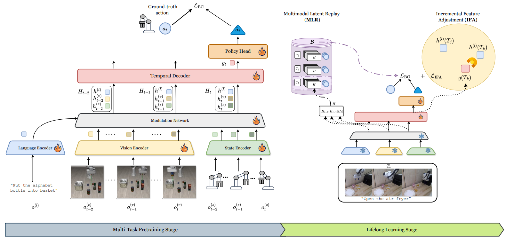

# Lifelong Imitation Learning with Multimodal Latent Replay and Incremental Adjustment

[](https://arxiv.org/abs/2603.10929)

<p align="center">
  
</p>

Official implementation of the paper  "LIL-MLR-IFA"

Accepted at **CVPR 2026**.

MLR-IFA consists of two main components:

- **Multimodal Latent Replay (MLR)**: stores compact latent features for replay instead of raw demonstrations.
- **Incremental Feature Adjustment (IFA)**: stabilizes lifelong adaptation by regularizing task representations when learning new tasks.

This repository is currently under active cleanup.

## Current Release Status

The current uploaded code mainly includes the **lifelong learning stage** for:

- `LIBERO-GOAL`
- `LIBERO-OBJECT`

Specifically, this version includes scripts for:

1. Saving latent features for accelerating lifelong adaptation.
2. Running lifelong adaptation.
3. Testing/evaluating the lifelong policy.

The multitask pretraining code and full LIBERO-50 support will be uploaded later.

## Pretrained Models

The pretrained multitask checkpoints are available on Google Drive:

[Download pretrained models](https://drive.google.com/drive/folders/1NOiyhkb1Hni_ElhqcN7GkiXnfCqOKiSH)

After downloading, please place the checkpoints under a local directory, for example:

## Environment Setup

We recommend creating a clean conda environment with Python 3.8 and installing dependencies using `pip`.

```bash
conda create -n libero python=3.8
conda activate libero

pip install -r requirements.txt
pip install -e .
```

## Reproduction Instructions

The current release supports the lifelong adaptation stage for `LIBERO-GOAL` and `LIBERO-OBJECT`.

### Reproduce Lifelong Adaptation

Taking `LIBERO-GOAL` as an example, first save replay features:

```bash
./save_feature_goal.sbatch
```

Then run lifelong adaptation:

```bash
./lifelong_adaptation_goal.sbatch
```

Finally evaluate the trained policy:

```bash
./test.sbatch
```

Before running, please modify the file and directory paths in the corresponding `.sbatch` scripts.

The workflow for `LIBERO-OBJECT` is the same. Use the corresponding object scripts, such as:

```bash
./save_feature_object.sbatch
./lifelong_adaptation_object.sbatch
```

### Additional Notes

1. Some scripts may manually add the system path, for example:

```python
sys.path.insert(0, "/work")
```

Please modify this path according to your local project directory before running.

2. The `buffer_dir` is recommended to be used only once for each run. To avoid loading stale replay buffers from previous experiments, please use a new buffer directory when running a new experiment, for example:

```bash
+buffer_dir=./buffer_goal_run1
```

## Citation

If you find this work useful, please consider citing:

```bibtex
@inproceedings{yu2026lifelong,
  title={Lifelong imitation learning with multimodal latent replay and incremental adjustment},
  author={Yu, Fanqi and Tiezzi, Matteo and Apicella, Tommaso and Beyan, Cigdem and Murino, Vittorio},
  booktitle={Proceedings of the IEEE/CVF Conference on Computer Vision and Pattern Recognition},
  pages={6740--6749},
  year={2026}
}
```
## TODO

- [ ] Upload multitask pretraining scripts.
- [ ] Upload scripts and configs for LIBERO-50.
